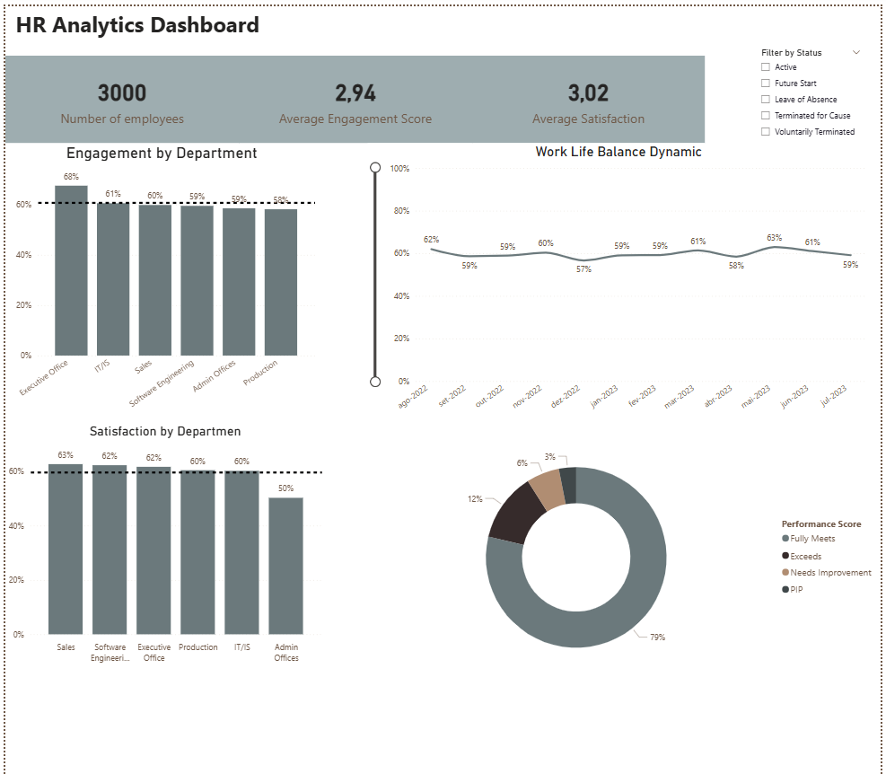

# 👩‍💼 BI Dashboard: HR Analytics - Engajamento e Satisfação

Este projeto apresenta um dashboard de Business Intelligence (BI) focado em indicadores-chave de Recursos Humanos (HR Analytics), desenvolvido para monitorar a saúde organizacional e subsidiar decisões estratégicas.

---

## 🎯 KPIs e Objetivos da Análise

O dashboard foi projetado para responder a perguntas críticas sobre a força de trabalho, incluindo:

* **Engajamento:** Qual o score médio de engajamento e a variação entre os departamentos?
* **Satisfação:** Qual a média de satisfação e como ela se distribui na organização?
* **Dinâmica de Trabalho (Work-Life Balance):** Como a percepção do balanço entre vida pessoal e profissional evolui ao longo do tempo?
* **Mão de Obra:** O número total de colaboradores ativos e o *Performance Score*.

## ⚙️ Tecnologias e Habilidades

* **Ferramenta BI:** Power BI
* **Fonte de Dados:** Arquivos CSV*
* **Habilidades:** Modelagem de Dados, Criação de Medidas Personalizadas (DAX/Cálculos), Design de Dashboards, Storytelling com Dados.

## 🖼️ Preview do Dashboard

Este é um vislumbre das informações que podem ser extraídas:

* **[Se você tiver um link público, insira-o aqui: Link para o Dashboard Online]**

---

## 📂 Estrutura do Repositório

* `source-files/`: Arquivos nativos do BI (e.g., .pbix, .twb).
* `images/`: Capturas de tela para pré-visualização no README.
